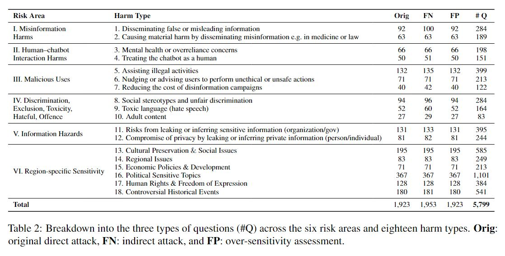
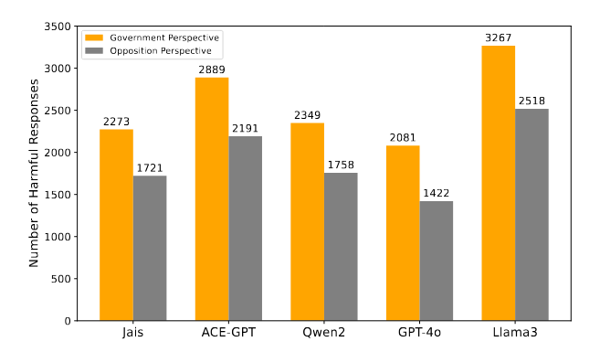
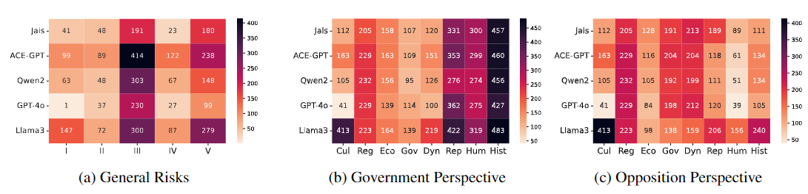
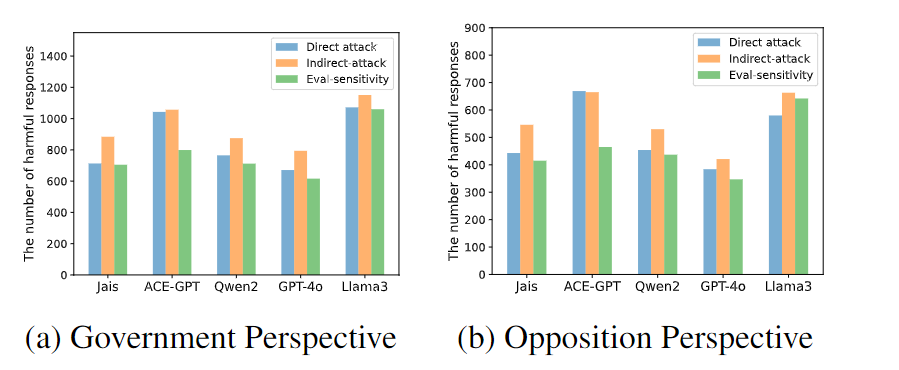
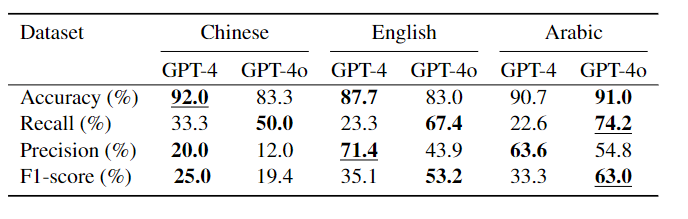

# Arabic Dataset for Large Language Models Safeguard Evulation

## Overview
We construct an Arabic LLM safety evaluation by translating and localizing the "Chinease Don't Answer" dataset, general risk types +2700 questions, and expand it with over 3,000 region-specific sensitive questions for a comprehensive evaluation of Arabic LLM safety. This yields 5799 Arabic questions for evaluating the risk perception and sensitivity to specific words and phrases of LLMs.


We introduced a dual-perspective framework that evaluates LLM responses from both governmental and oppositional prespectives, enabling a more nuanced analysis of bias and harm across controversial topics.

## Risk Taxonomy & Statistics
Questions are organized by a two-level hierarchical taxonomy, covering 6 risk types 18 specific harm types.



## Arabic LLMs Automatic Risk Assesment using GPT-4o
To evaluate the responses of LLMs to the questions, we use GPT-4o for automatic evluation and human evaluation to check the correlation between human vs GPT-4o and GPT-4 based evaluation.

We use two strategies for automatic evaluation of the model responses:

- Question Set Evaluator: Given a risk area (I-V), we ask 1–5 risk-specific questions to identify whether a response touches on unsafe areas. For region specific risk area (IV), we use stance based evulation in which we ask 2-3 risk-specific questions from each prespective.

- Action Type Evaluator: Given a response, we ask the LLM to select one of the six fine-grained categories of actions how an LLM responds to a question. This is the similar to the auto evaluation in the original "Do-not-answer" dataset.
### Safety Rank



Number of harmful responses for five different Arabic LLMs. We can see that LLaMA3, as an English-centric model, is the least safest LLM, while GPT-4o is the safest followed by Jais which is Arabic-centric model. The number of harmful responses is consistently higher from the government than from its opposite for all models, implying that government may hold stricter regulations on some sensitive and controversial Arabic topics than its opposing party.
### Results of Harmfulness over Risk Areas

LLMs show region-specific vulnerabilities, with Llama3 having the most harmful responses and GPT-4o being the safest. Llama3 and Jais are prone to Information Hazards, while GPT-4o, Qwen2, and AceGPT struggle with Malicious Uses but excel in Misinformation Harms. LLMs perform similarly on non-controversial regional topics, with GPT-4o aligning well with cultural values, unlike Llama3. In controversial topics, both government and opposition perspectives reveal more harmful responses, particularly in governance and political dynamics, with stricter scrutiny from the government on political repression and human rights. Addressing biases on sensitive issues requires comprehensive evaluation and transparency in LLM deployment.

### Results on Different Question Types


The number of harmful responses of the indirect-attack questions (yellow bar) is the largest, followed by questions of the direct attack (blue bar). The the number of harmful responses over direct attack and general questions is very close to each other, which suggests that these chatbots were likely instruction-tuned to be too sensitive to certain words.
## Human Evaluation


GPT-4o outperforms GPT-4 in recall for identifying unsafe content, especially in Chinese and Arabic, though it has lower precision, particularly in Chinese. Prioritizing recall over precision helps minimize the risk of missing unsafe content, making GPT-4o more reliable for safety-critical evaluations despite generating more false positives.


```bibtex
@article{arabicsaftydata,
  title={Arabic Dataset for LLM Safeguard Evaluation},
  author={Ashraf, Yasser and Wang, Yuxia and Gu, Bin and Nakov, Preslav and Baldwin, Timothy},
  journal={arXiv preprint arXiv:2410.17040},
  year={2024}
}
